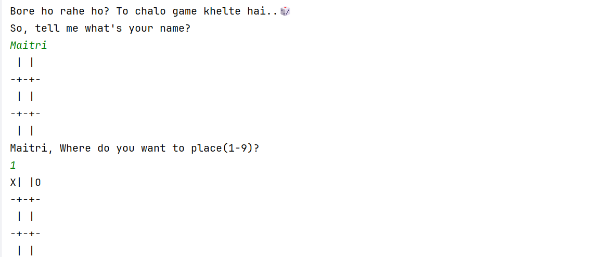
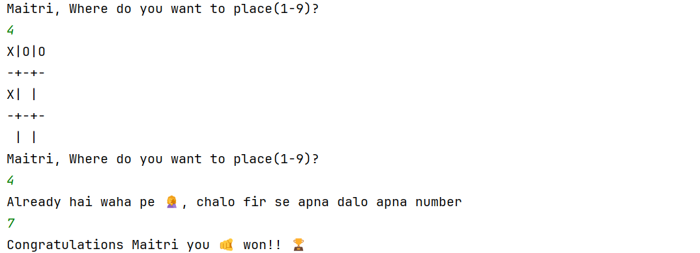
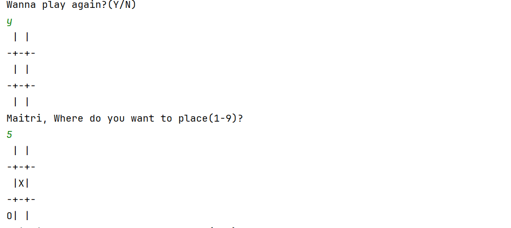
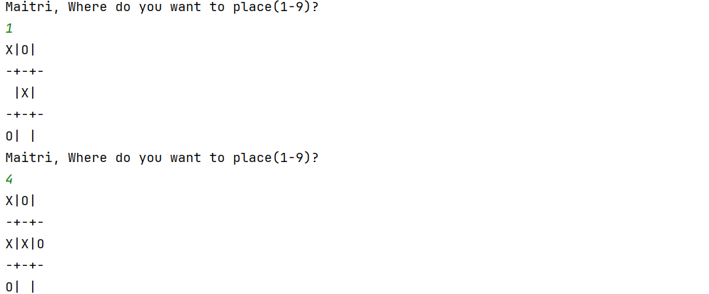
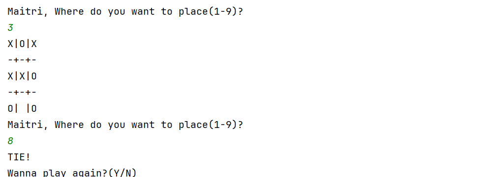
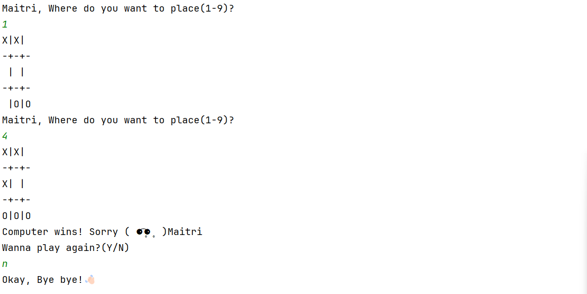

# Tic-Tac-Toe Implementation Details 🎲🎮

### Variables used with their Details
- board - Object of Board class
- player - Object of Player class
- cpu - Object of CPU class
- playAgain - flag
- pos - stores number that user enters as input/ stores numbers that CPU generates with the help of Random fucntion
- result - To store string that has message of win,loose or tie.
- symbols = 'X' or 'O'
- 

### Methods & Contructors used with their Details
> Board class
- Board Constructor - Resets the board whenever a new object of board is created
- printBoard
- placePiece(int pos, char symbol) - puts the symbols on specified position by user
- isPositionTaken(int id) - checks if the symbols is present at given position or not
- containsSymbol(char c, char[] symbol)
- checkWinner(List<Integer> playerPositions,List<Integer> cpuPositions,String playerName)

>Game class
- Game constructor - To initialize board, player and cpu objects whenver game starts
- start() -
- playerTurn()
- cpuTurn()
- checkWinner(String playerName)

>Player class
- Player constructor - creates List for players moves to store
- setName()
- getName()
- addPositions()
- getPositions()
- resetPositions()

> CPU class
- generateMove()
- addPositions(int pos)
- generateMove() - Random function here generates any number between 1-9
- getPositions()
- resetPositions()

> TicTacToe
- Main method here starts the game.
### Outputs

User Winning the Game:

Tie between user and computer:

Computer Winning the Game:

