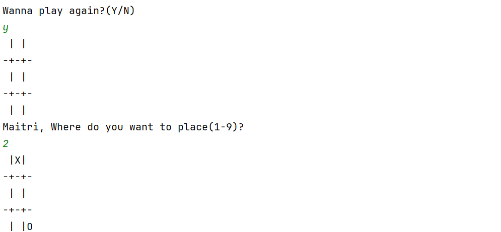

# Tic-Tac-Toe Implementation Details 🎲🎮

### Variables used with their Details
- playerPositions - Stores numbers that user has entered for the placement of their symbols
- cpuPositions - Stores numbers that computer generates by Random function
- playerName 
- playAgain 
- board -> 2D Array to visualize moves
- playerPos - Used to store position that player entered to put their symbol
- cpuPos - Used to store position(Generated by random function) that computer entered to put their symbol
- result - Stores the string output generated by checkWinner method
- response - Stores response if user want to play another match or not
- symbol - 'X' and 'O' 
#### List Objects used:
- topRow
- midRow
- bottonRow
- leftCol
- midCol
- rightCol
- cross1
- cross2
- winning

### Methods used with theie Details
- printBoard(char [][] board) 
- placePiece(char [][] board, int pos, String user) - Assigns symbols to User and CPU & places the symbol on given position in the board
- checkWinner(String playerName) - After every single input checks the conditions of TicTacToe game to win or TIE.

### Outputs

User Winning the Game:

Tie between user and computer:

Computer Winning the Game:

